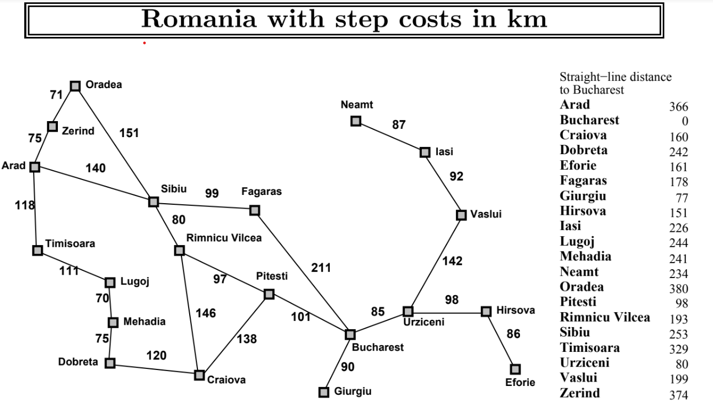

## Shortest Path

> Bagian dari search algoritma untuk menemukan jalur terpendek dari satu titik menuju tujuan. Codingan bisa dicek di [link berikut](shortest_path.ipynb)
---
Pada case ini menggunakan informasi jarak dan keterkaitan setiap kota di Rumania sesuai pada gambar berikut

Menggunakan pilihan dari 2 metode search algorithm dengan target menuju **Bucharest**, sebagai berikut:
1. Greedy Search
   $$f(n)=h(n)$$
2. A* Search
   $$f(n)=g(n)+h(n)$$

dengan:
> g(n) = Jarak dari titik awal menuju n.
> 
> g(n) = Estimasi jarak ke tujun dari n.
> 
> f(n) = Total cost dari jalur dari n ke tujuan